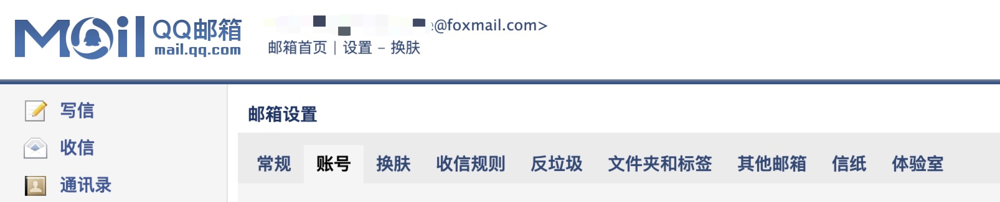
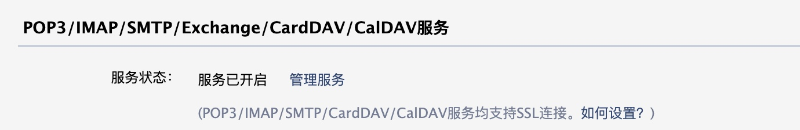

# Simplemail

简单的python包，用于发送邮件。

# Installation

```bash
pip install git+https://github.com/tanganke/simplemail.git
```

# Usage

默认情况下，邮件会发送到自己。

1. 作为CLI应用程序使用，这也会在第一次生成配置文件：

```bash
simplemail 'subject:test' 'test mail'
```

2. 在您的Python代码中使用它：

```python
from simplemail import send_mail

send_mail(subject='subject:test', contents='test mail')
```

您的配置在 `~/.config/simplemail/config.yaml` 中，使用默认模式 `600`（仅可被当前用户读写）。

## 如何得到SMTP授权码（密码）

以QQ邮箱为例，进入QQ邮箱，选择设置->账号



选择POP3/IMAP/SMTP/Exchange/CardDAV/CalDAV服务，开启POP3/SMTP服务，点击“管理服务”，一顿操作后会得到一个授权码，这个授权码就是密码。


